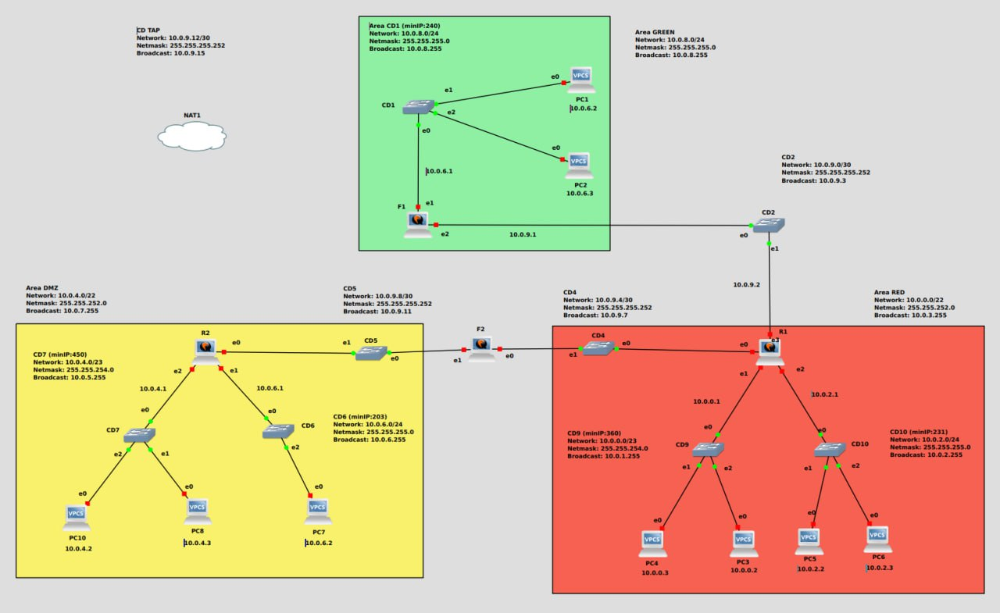

1 - https://github.com/fpacenza/Fondamenti-di-Reti-e-Sicurezza-Informatica/tree/main/Subnetting
2 - https://github.com/fpacenza/Fondamenti-di-Reti-e-Sicurezza-Informatica/tree/main/Routing
3 - https://github.com/fpacenza/Fondamenti-di-Reti-e-Sicurezza-Informatica/tree/main/Internet%20e%20TAP
4 - https://github.com/fpacenza/Fondamenti-di-Reti-e-Sicurezza-Informatica/tree/main/SSH%20e%20Backup
5 - https://github.com/fpacenza/Fondamenti-di-Reti-e-Sicurezza-Informatica/tree/main/Netfilter
6 - https://github.com/fpacenza/Fondamenti-di-Reti-e-Sicurezza-Informatica/tree/main/Firewall%20e%20NAT

