### 1. **Comprendere il Concetto dei Design Pattern**

- **Definizione**: I design pattern sono soluzioni tipiche a problemi comuni nella progettazione del software.
- **Obiettivo**: Semplificare lo sviluppo del software rendendo più chiaro e manutenibile il codice.

### 2. **Riflessione**

- **Valuta il Contesto**: Non tutti i pattern sono adatti per ogni situazione. Scegli il pattern adeguato in base alle esigenze del tuo progetto, considerando fattori come la complessità dell'oggetto da creare, la necessità di estensioni future, il grado di accoppiamento desiderato, e altri requisiti specifici del dominio.
- **Combinazione con Altri Pattern**: A volte, combinare diversi pattern può portare a soluzioni più robuste.
- **Attenzione alla violazione dei principi SOLID**, specialmente:
  - Single Responsibility Principle.
  - Open/Closed Principle.

- **Ricorda che l'uso eccessivo di pattern può portare a una complessità non necessaria**.
  - Utilizzali solo quando offrono un chiaro vantaggio in termini di manutenibilità, estensibilità e comprensione del codice.

# Pattern Creazionali

- **Singleton**: Garantisce che una classe abbia una sola istanza e fornisce un punto di accesso globale a quella istanza.
- **Factory Method**: Definisce un'interfaccia per creare un oggetto, ma lascia che le sottoclassi decidano quale classe istanziare.
- **Abstract Factory**: Fornisce un'interfaccia per creare famiglie di oggetti correlati senza specificare le loro classi concrete.
- **Builder**: Separa la costruzione di un oggetto complesso dalla sua rappresentazione, in modo che lo stesso processo di costruzione possa creare diverse rappresentazioni.
- **Prototype**: Crea nuovi oggetti clonando un prototipo.

## Caratteristiche generali

### 1. Singleton

- **Scopo**:
  - Garantire che una classe abbia una sola istanza e fornire un punto di accesso globale a tale istanza.
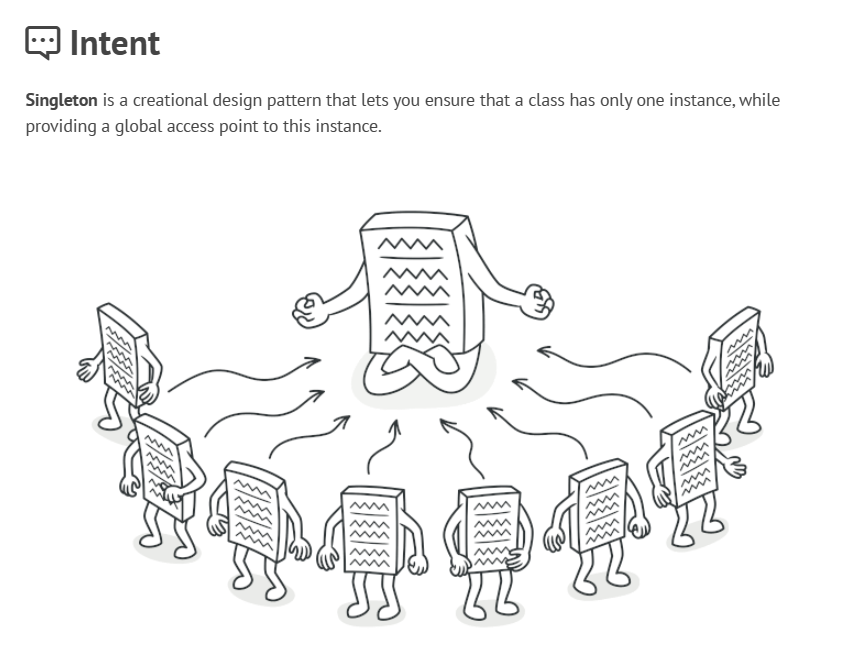
- **Caratteristiche**:
  - Costruttore privato per prevenire l'istanziazione diretta.
  - Un metodo statico che restituisca l'unica istanza esistente della classe.

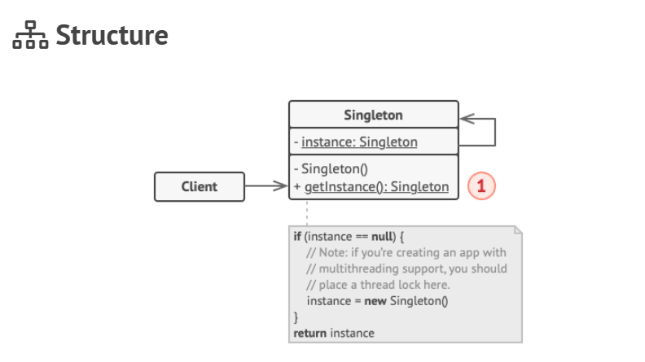

#### Esempio di implementazione in java

~~~ java
public class Database {
    private static Database instance;

    private Database() {
        // Codice di inizializzazione, come la connessione effettiva al server del database
    }

    public static Database getInstance() {
        if (instance == null) {
            synchronized (Database.class) {
                if (instance == null) {
                    instance = new Database();
                }
            }
        }
        return instance;
    }

    public void query(String sql) {
        // Logica per eseguire query al database, come throttling o caching
    }
}

public class Application {
    public static void main(String[] args) {
        Database foo = Database.getInstance();
        foo.query("SELECT ...");
        // ...
        Database bar = Database.getInstance();
        bar.query("SELECT ...");
        // La variabile `bar` conterrà lo stesso oggetto della variabile `foo`
    }
}
~~~

### 2. Factory Method

- **Scopo**:
  - Definire un'interfaccia per creare un oggetto, ma lasciare che le sottoclassi decidano quale classe istanziare.

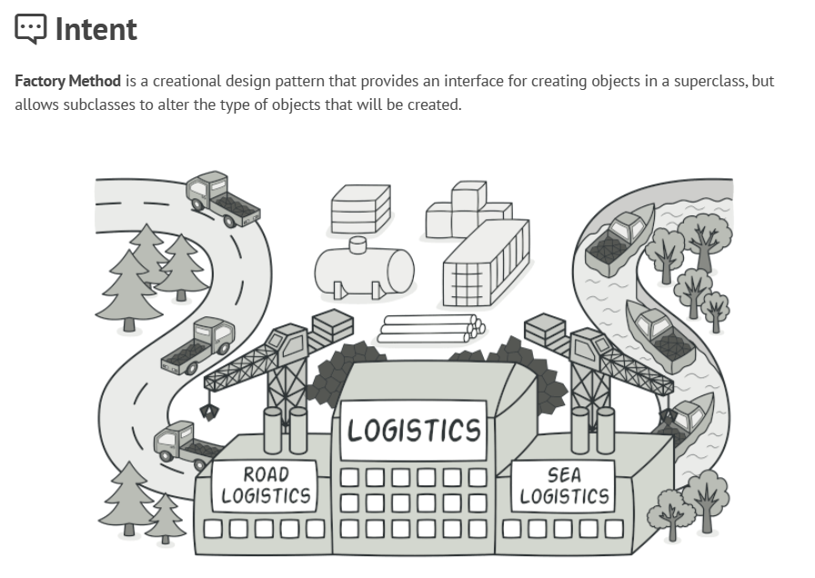

- **Caratteristiche**:
  - Definisci un'interfaccia o una classe astratta con un metodo astratto (factory) senza implementazione.
  - Lascia che le sottoclassi implementino questo metodo per creare oggetti di classi appropriate.
  - Usalo per delegare la responsabilità della creazione dell'oggetto a sottoclassi, promuovendo il **loose coupling**.

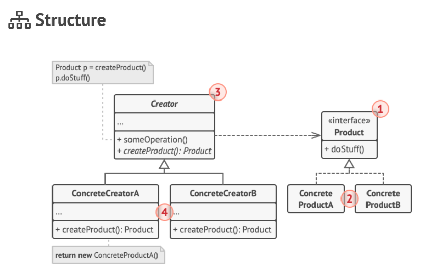

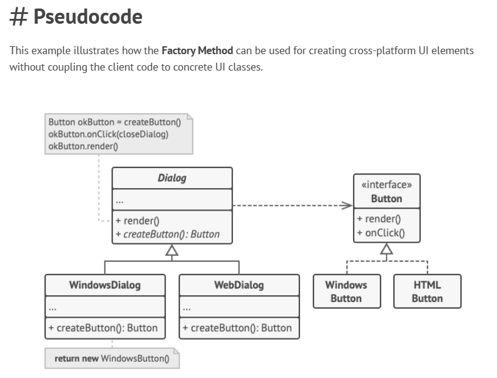

#### Esempio di implementazione in java

~~~java
abstract class Dialog {
    abstract Button createButton();

    void render() {
        Button okButton = createButton();
        okButton.onClick(this::closeDialog);
        okButton.render();
    }

    void closeDialog() {
        // Logica per chiudere la finestra di dialogo
    }
}

class WindowsDialog extends Dialog {
    @Override
    Button createButton() {
        return new WindowsButton();
    }
}

class WebDialog extends Dialog {
    @Override
    Button createButton() {
        return new HTMLButton();
    }
}

interface Button {
    void render();
    void onClick(Runnable f);
}

class WindowsButton implements Button {
    public void render() {
        // Renderizza un bottone in stile Windows
    }

    public void onClick(Runnable f) {
        // Associa un evento click nativo dell'OS
    }
}

class HTMLButton implements Button {
    public void render() {
        // Restituisce una rappresentazione HTML di un bottone
    }

    public void onClick(Runnable f) {
        // Associa un evento click del browser web
    }
}

class Application {
    Dialog dialog;

    void initialize() {
        Config config = readApplicationConfigFile();

        if (config.OS.equals("Windows")) {
            dialog = new WindowsDialog();
        } else if (config.OS.equals("Web")) {
            dialog = new WebDialog();
        } else {
            throw new Exception("Errore! Sistema operativo sconosciuto.");
        }
    }

    void main() {
        this.initialize();
        dialog.render();
    }
}
~~~

### 3. Abstract Factory

- **Scopo**:
  - Fornire un'interfaccia per creare famiglie di oggetti correlati o dipendenti senza specificarne le classi concrete.
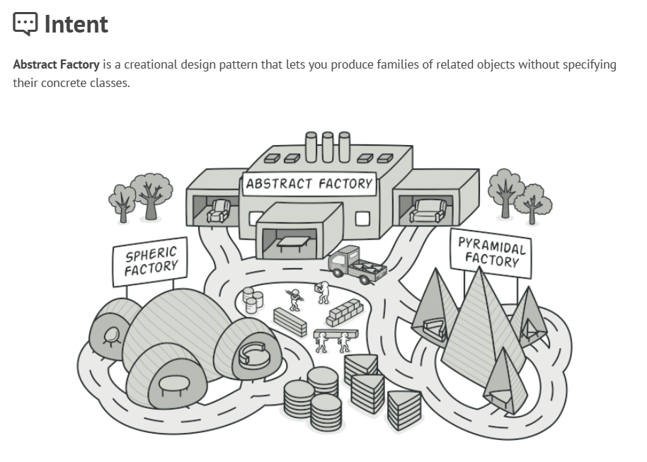

- **Caratteristiche**:
  - Crea interfacce astratte per ogni tipo di oggetto che desideri creare.
  - Implementa queste interfacce in classi concrete raggruppate in "famiglie".
  - Assicurati che il codice che utilizza queste fabbriche operi solo con le interfacce, non con le implementazioni concrete.

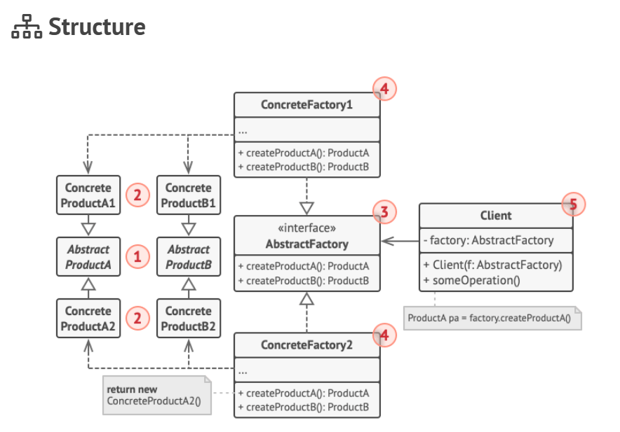

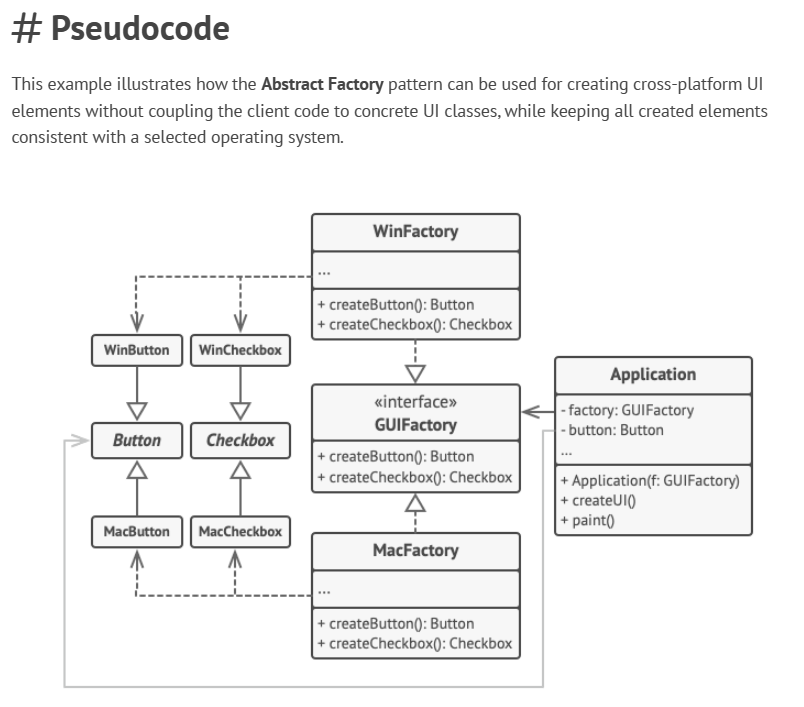

#### Esempio di implementazione in java

~~~java
interface GUIFactory {
    Button createButton();
    Checkbox createCheckbox();
}

class WinFactory implements GUIFactory {
    public Button createButton() {
        return new WinButton();
    }

    public Checkbox createCheckbox() {
        return new WinCheckbox();
    }
}

class MacFactory implements GUIFactory {
    public Button createButton() {
        return new MacButton();
    }

    public Checkbox createCheckbox() {
        return new MacCheckbox();
    }
}

interface Button {
    void paint();
}

class WinButton implements Button {
    public void paint() {
        // Renderizza un bottone in stile Windows
    }
}

class MacButton implements Button {
    public void paint() {
        // Renderizza un bottone in stile macOS
    }
}

interface Checkbox {
    void paint();
}

class WinCheckbox implements Checkbox {
    public void paint() {
        // Renderizza una checkbox in stile Windows
    }
}

class MacCheckbox implements Checkbox {
    public void paint() {
        // Renderizza una checkbox in stile macOS
    }
}

class Application {
    private GUIFactory factory;
    private Button button;

    public Application(GUIFactory factory) {
        this.factory = factory;
    }

    public void createUI() {
        this.button = factory.createButton();
    }

    public void paint() {
        button.paint();
    }
}

class ApplicationConfigurator {
    public static void main(String[] args) {
        Config config = readApplicationConfigFile();

        GUIFactory factory;
        if (config.OS.equals("Windows")) {
            factory = new WinFactory();
        } else if (config.OS.equals("Mac")) {
            factory = new MacFactory();
        } else {
            throw new RuntimeException("Errore! Sistema operativo sconosciuto.");
        }

        Application app = new Application(factory);
    }
}
~~~

### 4. Builder

- **Scopo**:
  - Separare la costruzione di un oggetto complesso dalla sua rappresentazione, in modo che lo stesso processo di costruzione possa creare diverse rappresentazioni.
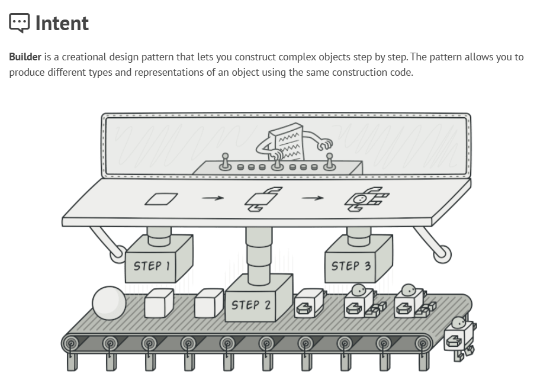

- **Caratteristiche**:
  - Differenzia tra il processo di costruzione (Builder) e la rappresentazione finale (Product).
  - Il Builder è di solito una classe astratta o un'interfaccia che definisce i passi per costruire il prodotto finale.
  - Permette la costruzione di un oggetto passo dopo passo, spesso attraverso una fluent interface.
  - Isola il codice cliente dalla costruzione interna dell'oggetto.

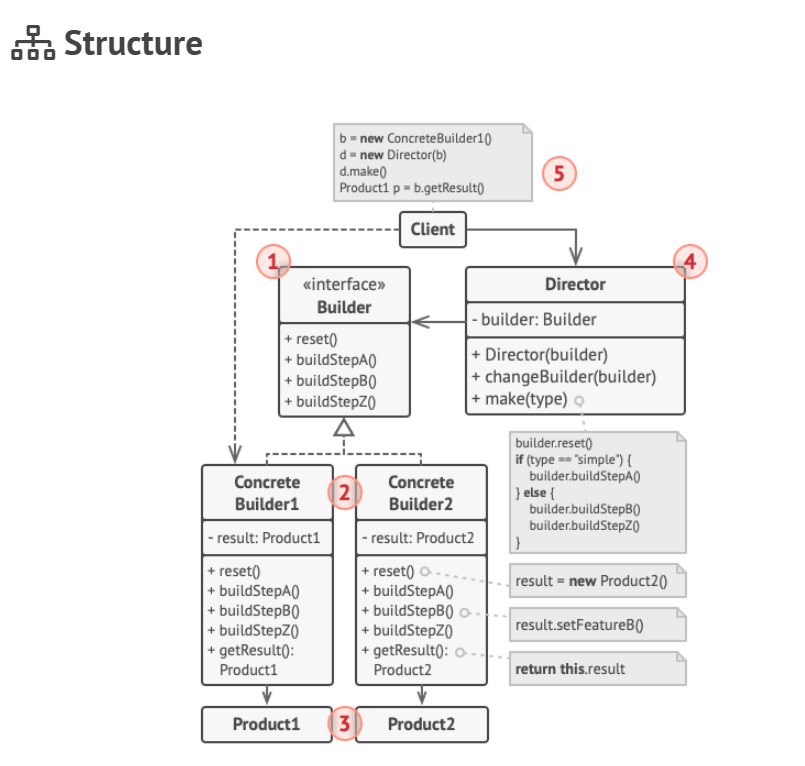

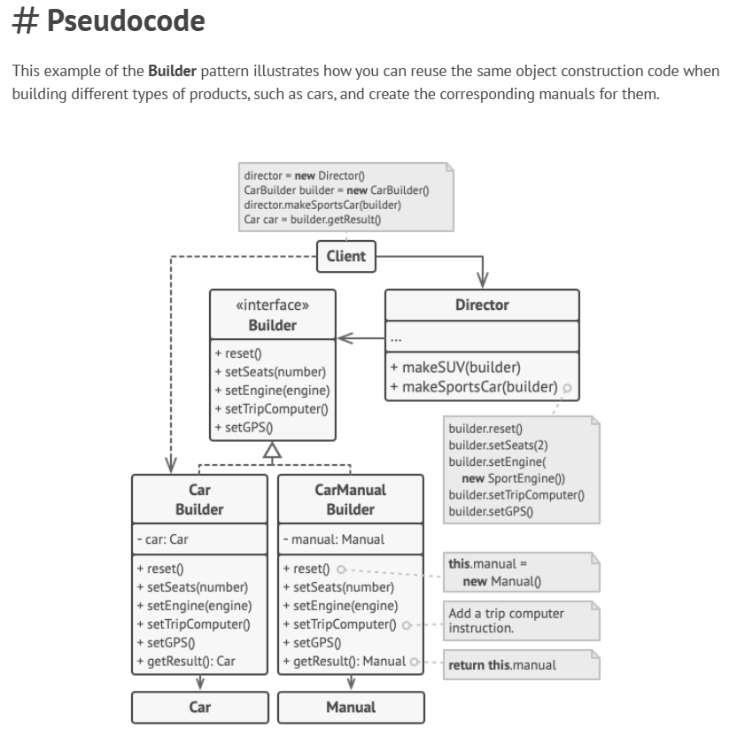

#### Esempio di implementazione in java

~~~java
class Car {
    // Proprietà di Car come GPS, trip computer, numero di sedili, ecc.
}

class Manual {
    // Proprietà di Manual che corrispondono alla configurazione dell'auto
}

interface Builder {
    void reset();
    void setSeats(int number);
    void setEngine(Engine engine);
    void setTripComputer(boolean present);
    void setGPS(boolean present);
}

class CarBuilder implements Builder {
    private Car car;

    public CarBuilder() {
        this.reset();
    }

    public void reset() {
        this.car = new Car();
    }

    public void setSeats(int number) {
        // Imposta il numero di sedili
    }

    public void setEngine(Engine engine) {
        // Installa un motore specifico
    }

    public void setTripComputer(boolean present) {
        // Installa il trip computer
    }

    public void setGPS(boolean present) {
        // Installa il sistema GPS
    }

    public Car getProduct() {
        Car product = this.car;
        this.reset();
        return product;
    }
}

class CarManualBuilder implements Builder {
    private Manual manual;

    public CarManualBuilder() {
        this.reset();
    }

    public void reset() {
        this.manual = new Manual();
    }

    public void setSeats(int number) {
        // Documenta le caratteristiche dei sedili
    }

    public void setEngine(Engine engine) {
        // Aggiungi istruzioni per il motore
    }

    public void setTripComputer(boolean present) {
        // Aggiungi istruzioni per il trip computer
    }

    public void setGPS(boolean present) {
        // Aggiungi istruzioni per il GPS
    }

    public Manual getProduct() {
        Manual product = this.manual;
        this.reset();
        return product;
    }
}

class Director {
    public void constructSportsCar(Builder builder) {
        builder.reset();
        builder.setSeats(2);
        builder.setEngine(new SportEngine());
        builder.setTripComputer(true);
        builder.setGPS(true);
    }

    public void constructSUV(Builder builder) {
        // Costruisci un SUV
    }
}

class Application {
    public void makeCar() {
        Director director = new Director();

        CarBuilder carBuilder = new CarBuilder();
        director.constructSportsCar(carBuilder);
        Car car = carBuilder.getProduct();

        CarManualBuilder manualBuilder = new CarManualBuilder();
        director.constructSportsCar(manualBuilder);
        Manual manual = manualBuilder.getProduct();
    }
}

// Classi ausiliarie come Engine, SportEngine, ecc., dovrebbero essere definite in base alle esigenze.
~~~

## 5. Prototype

- **Scopo**:
  - Usare un oggetto prototipico per specificare i tipi di oggetti da creare e creare nuovi oggetti copiando questo prototipo.
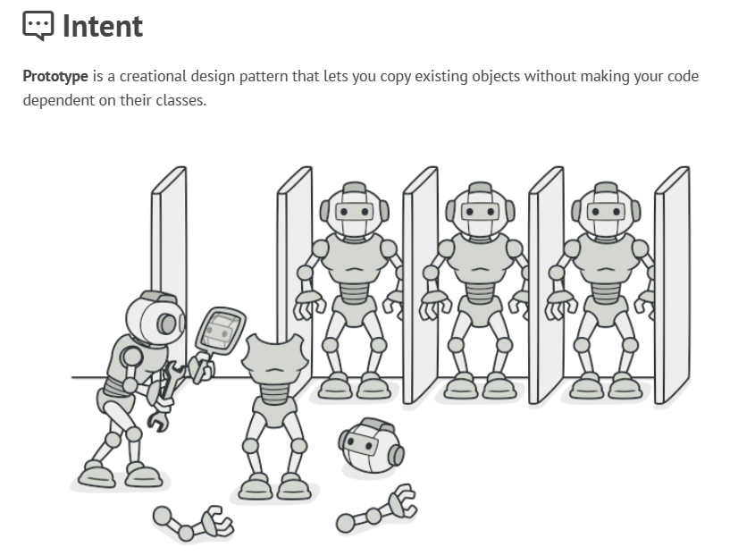

- **Caratteristiche**:
  - Implementa un'interfaccia che consente agli oggetti di essere clonati.
  - L'oggetto originale (prototipo) deve essere in grado di creare una copia completa di se stesso.
  - È utile quando la creazione di un'istanza è più costosa che clonarne una esistente.

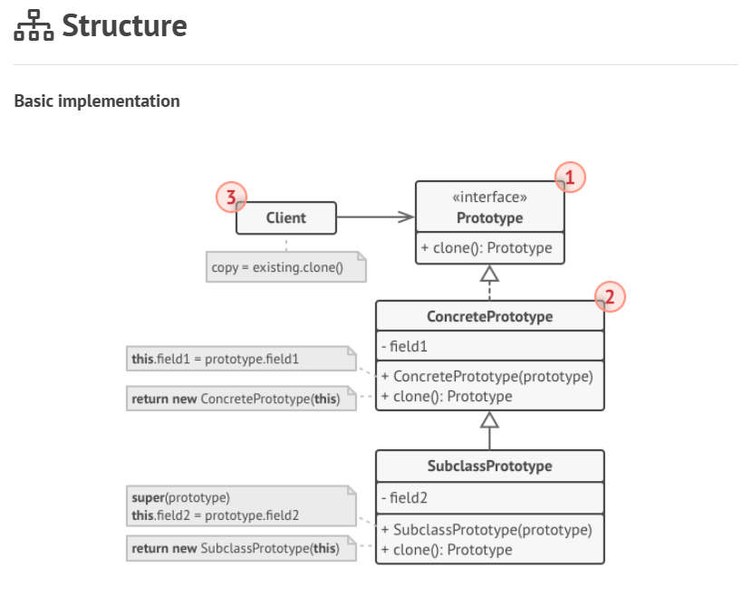
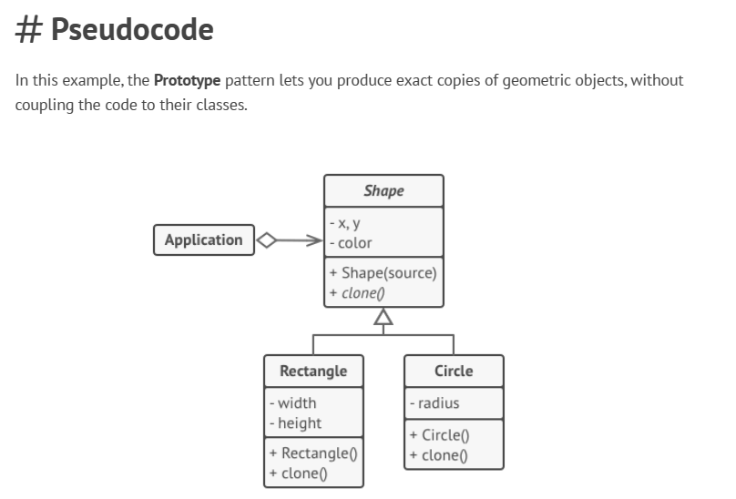

### Esempio di implementazione in java

~~~java
abstract class Shape {
    protected int X;
    protected int Y;
    protected String color;

    public Shape() {
        // Costruttore base
    }

    public Shape(Shape source) {
        this.X = source.X;
        this.Y = source.Y;
        this.color = source.color;
    }

    public abstract Shape clone();
}

class Rectangle extends Shape {
    private int width;
    private int height;

    public Rectangle(Rectangle source) {
        super(source);
        this.width = source.width;
        this.height = source.height;
    }

    @Override
    public Shape clone() {
        return new Rectangle(this);
    }
}

class Circle extends Shape {
    private int radius;

    public Circle(Circle source) {
        super(source);
        this.radius = source.radius;
    }

    @Override
    public Shape clone() {
        return new Circle(this);
    }
}

class Application {
    private Shape[] shapes;

    public Application() {
        shapes = new Shape[3];

        Circle circle = new Circle();
        circle.X = 10;
        circle.Y = 10;
        circle.radius = 20;
        shapes[0] = circle;

        Circle anotherCircle = (Circle) circle.clone();
        shapes[1] = anotherCircle;

        Rectangle rectangle = new Rectangle();
        rectangle.width = 10;
        rectangle.height = 20;
        shapes[2] = rectangle;
    }

    public void businessLogic() {
        Shape[] shapesCopy = new Shape[shapes.length];

        for (int i = 0; i < shapes.length; i++) {
            shapesCopy[i] = shapes[i].clone();
        }

        // `shapesCopy` contiene copie esatte degli elementi dell'array `shapes`
    }
}
~~~
