### 1. **Comprendere il Concetto dei Design Pattern**

- **Definizione**: I design pattern sono soluzioni tipiche a problemi comuni nella progettazione del software.
- **Obiettivo**: Semplificare lo sviluppo del software rendendo più chiaro e manutenibile il codice.

### 2. **Riflessione**

- **Valuta il Contesto**: Non tutti i pattern sono adatti per ogni situazione. Scegli il pattern adeguato in base alle esigenze del tuo progetto, considerando fattori come la complessità dell'oggetto da creare, la necessità di estensioni future, il grado di accoppiamento desiderato, e altri requisiti specifici del dominio.
- **Combinazione con Altri Pattern**: A volte, combinare diversi pattern può portare a soluzioni più robuste.
- **Attenzione alla violazione dei principi SOLID**, specialmente:
  - Single Responsibility Principle.
  - Open/Closed Principle.

- **Ricorda che l'uso eccessivo di pattern può portare a una complessità non necessaria**.
  - Utilizzali solo quando offrono un chiaro vantaggio in termini di manutenibilità, estensibilità e comprensione del codice.

<div class="page"/>

# Pattern Strutturali

I pattern strutturali sono principi di design in ingegneria del software che si concentrano sulla composizione delle classi e degli oggetti. Essi forniscono modi per creare strutture di oggetti più grandi mantenendo l'efficienza e la flessibilità. Ecco una panoramica dei pattern strutturali più comuni:

## 1. Adapter

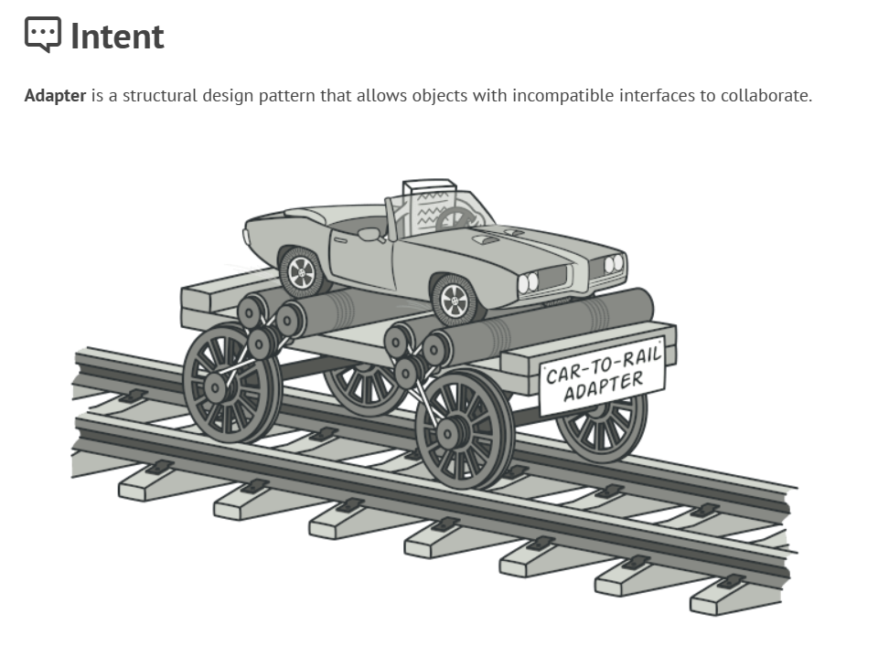

- **Scopo**:
  - Consente a interfacce incompatibili di collaborare.
  - Agisce come un ponte tra due interfacce incompatibili.
- **Caratteristiche**:
  - Impiega una classe "adapter" che si inserisce tra una nuova interfaccia e un'interfaccia esistente che il sistema già utilizza.
  - Può essere implementato attraverso l'ereditarietà o la composizione.

<div class="page"/>


L'immagine mostra il pattern Adapter applicato al problema di inserire chiodi quadrati in buchi rotondi. Il pattern consente agli oggetti con interfacce incompatibili di collaborare. Ecco i componenti chiave:

1. **RoundHole**: Classe che rappresenta un buco rotondo. Ha:
   - Un attributo `radius` per il raggio.
   - Un metodo `getRadius()` per ottenere il raggio.
   - Un metodo `fits(peg: RoundPeg)` per controllare se un RoundPeg si adatta.

2. **RoundPeg**: Classe che rappresenta un chiodo rotondo. Ha:
   - Un attributo `radius`.
   - Un metodo `getRadius()` per ottenere il raggio.

3. **SquarePeg**: Classe che rappresenta un chiodo quadrato. Ha:
   - Un attributo `width` per la larghezza.
   - Un metodo `getWidth()` per ottenere la larghezza.

4. **SquarePegAdapter**: Adapter per SquarePeg. Ha:
   - Un attributo `peg` di tipo SquarePeg.
   - Un costruttore che accetta un SquarePeg.
   - Un metodo `getRadius()` che calcola il raggio del più piccolo cerchio che può contenere il chiodo quadrato. Si calcola come `getWidth() * sqrt(2) / 2`.

L'Adapter permette di usare SquarePeg con RoundHole senza modificare le loro interfacce dirette, adattando la larghezza del chiodo quadrato al raggio necessario per il buco rotondo.

<div class="page"/>

### Esempio di implementazione in Java

```java
// Interfaccia esistente
interface LightningPhone {
    void recharge();
    void useLightning();
}

// Nuova interfaccia
interface MicroUsbPhone {
    void recharge();
    void useMicroUsb();
}

// Adapter
class LightningToMicroUsbAdapter implements MicroUsbPhone {
    private final LightningPhone lightningPhone;

    public LightningToMicroUsbAdapter(LightningPhone lightningPhone) {
        this.lightningPhone = lightningPhone;
    }

    @Override
    public void recharge() {
        lightningPhone.recharge();
    }

    @Override
    public void useMicroUsb() {
        System.out.println("MicroUsb connected");
        lightningPhone.useLightning();
    }
}
```

<div class="page"/>

## 2. Bridge

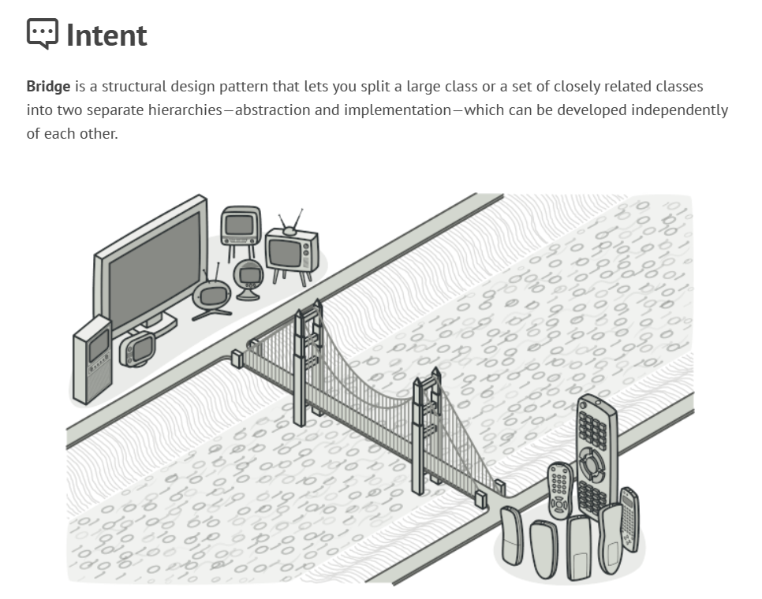

- **Scopo**:
  - Separa l'astrazione dall'implementazione in modo che le due possano variare indipendentemente.
- **Caratteristiche**:
  - Composto da un'interfaccia (astrazione) e implementazioni concrete.
  - Riduce il legame tra la logica di alto livello e le implementazioni di basso livello.

<div class="page"/>

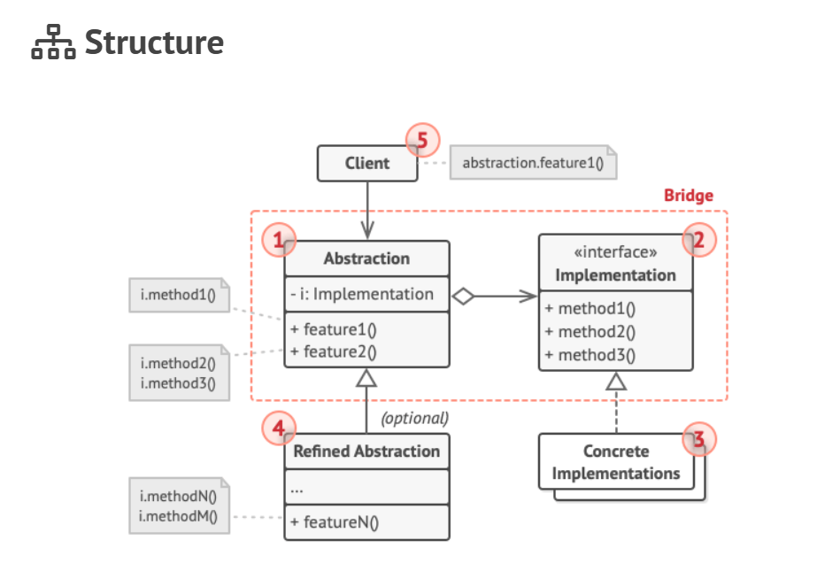


<div class="page"/>

### Esempio di implementazione in Java

```java
// Implementor
interface Device {
    void turnOn();
    void turnOff();
}

// Refined Abstraction
class RemoteControl {
    protected Device device;

    public RemoteControl(Device device) {
        this.device = device;
    }

    public void togglePower() {
        device.turnOn();
        // ...
        device.turnOff();
    }
}

class TV implements Device {
    @Override
    public void turnOn() {
        // Logica specifica per accendere la TV
    }

    @Override
    public void turnOff() {
        // Logica specifica per spegnere la TV
    }
}
```

<div class="page"/>

## 3. Composite

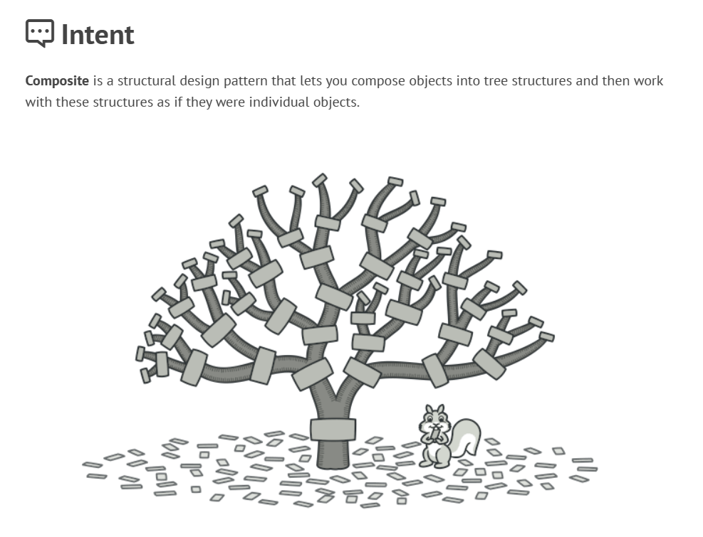

- **Scopo**:
  - Comporre oggetti in strutture ad albero per rappresentare gerarchie parte-intero.
  - Permette ai clienti di trattare oggetti singoli e composizioni di oggetti in modo uniforme.
- **Caratteristiche**:
  - Consiste in oggetti "leaf" (foglia) e container.
  - I container possono contenere leaf o altri container.

<div class="page"/>


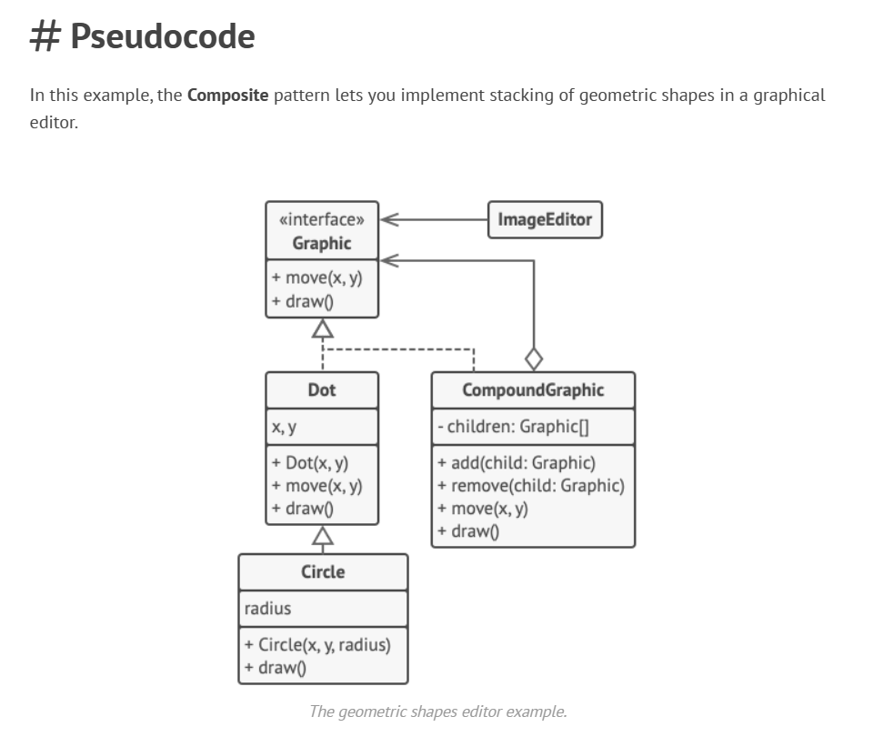

<div class="page"/>

### Esempio di implementazione in Java

```java
// Component
interface Graphic {
    void move(int x, int y);
    void draw();
}

// Leaf
class Dot implements Graphic {
    private int x, y;

    @Override
    public void move(int x, int y) {
        this.x += x;
        this.y += y;
    }

    @Override
    public void draw() {
        // Disegna il punto alle coordinate x, y
    }
}

// Composite
class CompoundGraphic implements Graphic {
    private List<Graphic> children = new ArrayList<>();

    public void add(Graphic child) {
        children.add(child);
    }

    @Override
    public void move(int x, int y) {
        for (Graphic child : children) {
            child.move(x, y);
        }
    }

    @Override
    public void draw() {
        for (Graphic child : children) {
            child.draw();
        }
    }
}
```

<div class="page"/>

## 4. Decorator

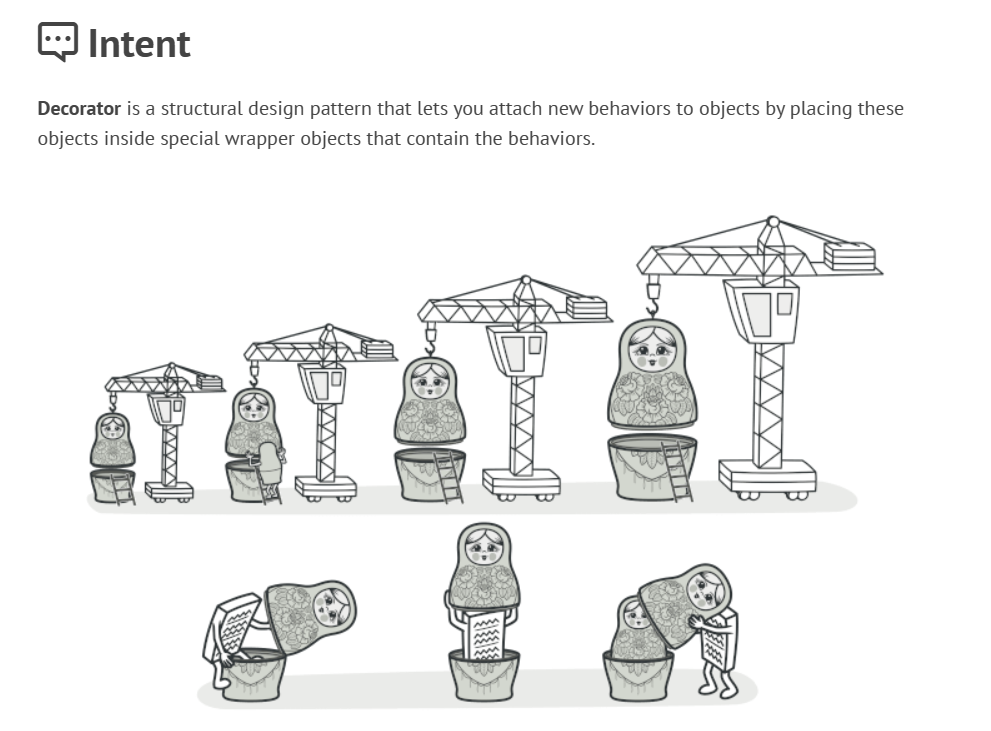

- **Scopo**:
  - Aggiunge dinamicamente nuove funzionalità a un oggetto senza alterare la sua struttura.
  - Fornisce un'alternativa flessibile all'ereditarietà per estendere le funzionalità.
- **Caratteristiche**:
  - Consiste in un "componente" di base e decorator che aggiungono comportamenti.
  - I decorator avvolgono il componente e implementano la stessa interfaccia.

<div class="page"/>


<div class="page"/>

### Esempio di implementazione in Java

```java
// Component
interface Coffee {
    double getCost();
    String getDescription();
}

// Concrete Component
class SimpleCoffee implements Coffee {
    @Override
    public double getCost() {
        return 10;
    }

    @Override
    public String getDescription() {
        return "Simple coffee";
    }
}

// Decorator
class MilkCoffee implements Coffee {
    private final Coffee coffee;

    public MilkCoffee(Coffee coffee) {
        this.coffee = coffee;
    }

    @Override
    public double getCost() {
        return coffee.getCost() + 2;
    }

    @Override
    public String getDescription() {
        return coffee.getDescription() + ", milk";
    }
}
```

<div class="page"/>

## 5. Facade

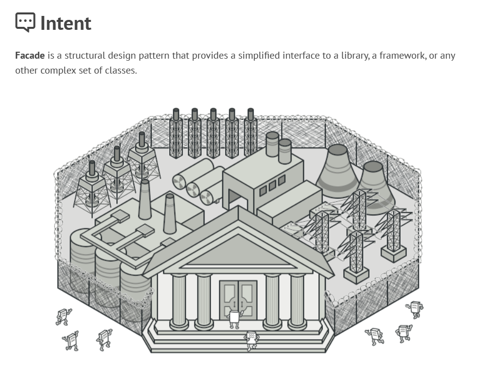

- **Scopo**:
  - Fornisce un'interfaccia semplificata a un sistema complesso.
  - Riduce la complessità di interazione con sistemi multipli.
- **Caratteristiche**:
  - Crea un'interfaccia unificata che rende più facile l'utilizzo del sistema sottostante.
  - Nasconde la complessità del sistema interno.

<div class="page"/>


<div class="page"/>

### Esempio di implementazione in Java

```java
// Facade
class ComputerFacade {
    private CPU cpu;
    private Memory memory;
    private HardDrive hardDrive;

    public ComputerFacade(CPU cpu, Memory memory, HardDrive hardDrive) {
        this.cpu = cpu;
        this.memory = memory;
        this.hardDrive = hardDrive;
    }

    public void start() {
        cpu.freeze();
        memory.load(BOOT_ADDRESS, hardDrive.read(BOOT_SECTOR, SECTOR_SIZE));
        cpu.jump(BOOT_ADDRESS);
        cpu.execute();
    }
}

// Client code
class Client {
    public static void main(String[] args) {
        ComputerFacade computer = new ComputerFacade(new CPU(), new Memory(), new HardDrive());
        computer.start();
    }
}
```

<div class="page"/>

## 6. Flyweight

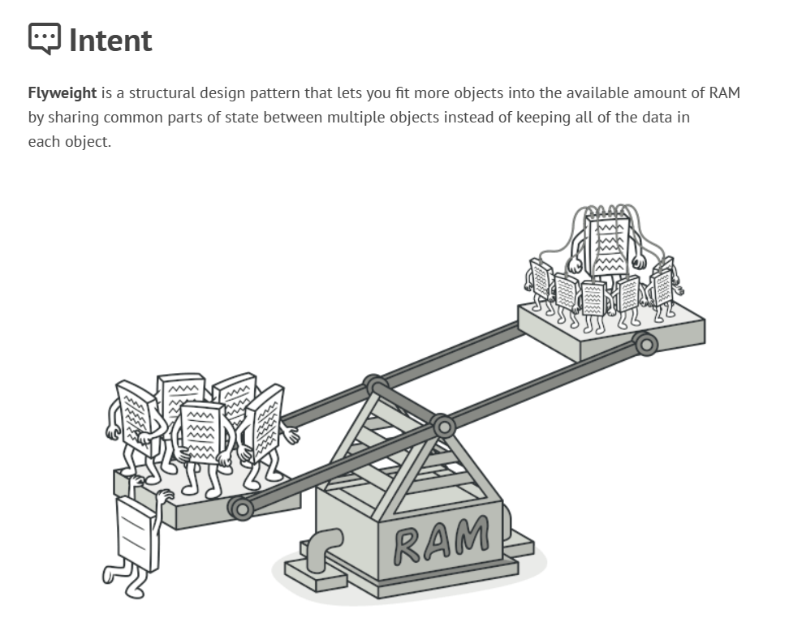

- **Scopo**:
  - Riduce l'uso della memoria condividendo il più possibile dati simili tra oggetti.
- **Caratteristiche**:
  - Usa oggetti "flyweight" condivisi per rappresentare stati che altrimenti sarebbero duplicati.
  - Separare lo stato intrinseco (indipendente dal contesto) da quello estrinseco (dipendente dal contesto).

<div class="page"/>

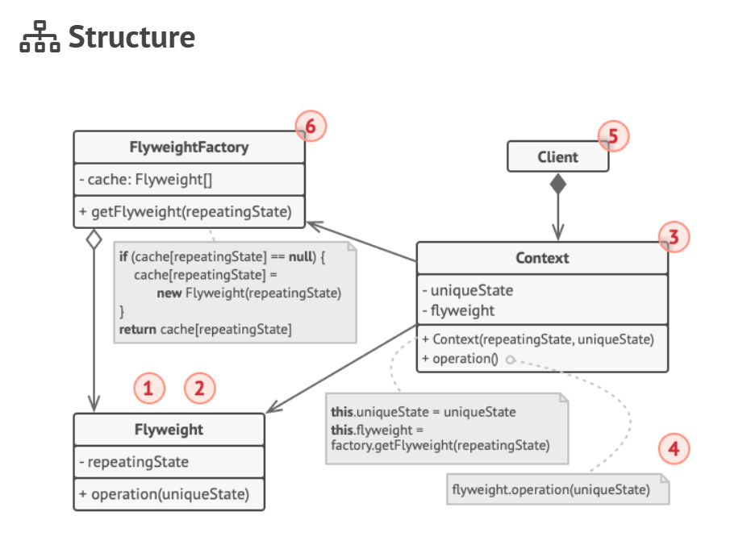

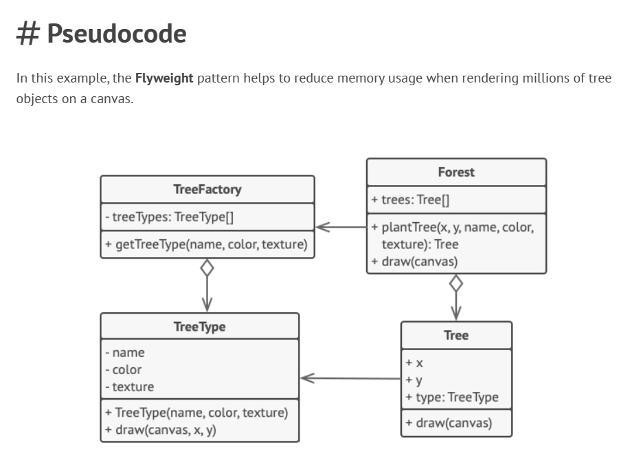

<div class="page"/>

### Esempio di implementazione in Java

```java
// Flyweight
class TreeType {
    private String name;
    private String color;
    private String texture;

    public TreeType(String name, String color, String texture) {
        this.name = name;
        this.color = color;
        this.texture = texture;
    }

    public void draw(Canvas canvas, int x, int y) {
        // Disegna un albero sul canvas
    }
}

// Flyweight Factory
class TreeFactory {
    static Map<String, TreeType> treeTypes = new HashMap<>();

    public static TreeType getTreeType(String name, String color, String texture) {
        TreeType result = treeTypes.get(name);
        if (result == null) {
            result = new TreeType(name, color, texture);
            treeTypes.put(name, result);
        }
        return result;
    }
}
```

<div class="page"/>

## 7. Proxy

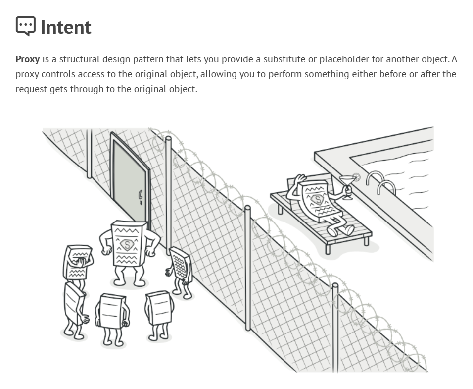

- **Scopo**:
  - Fornisce un surrogato o segnaposto per un altro oggetto per controllare l'accesso ad esso.
- **Caratteristiche**:
  - Può aggiungere funzionalità extra come lazy initialization, logging, access control, etc.
  - Implementa la stessa interfaccia dell'oggetto originale.

<div class="page"/>

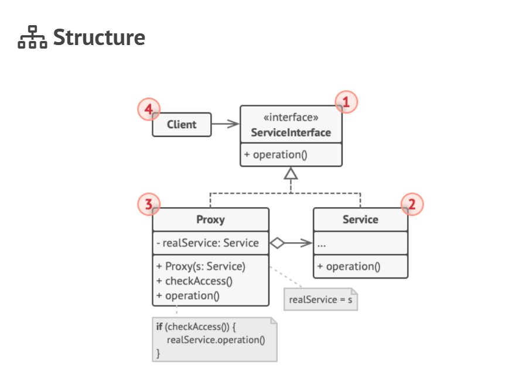

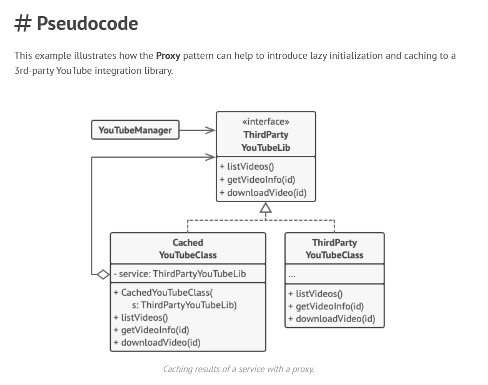

<div class="page"/>

### Esempio di implementazione in Java

```java
// Subject
interface Image {
    void display();
}

// Real Subject
class RealImage implements Image {
    private String fileName;

    public RealImage(String fileName) {
        this.fileName = fileName;
        loadFromDisk(fileName);
    }

    @Override
    public void display() {
        System.out.println("Displaying " + fileName);
    }
}
```
