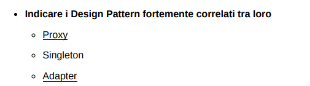
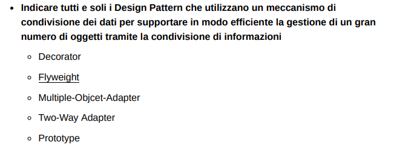
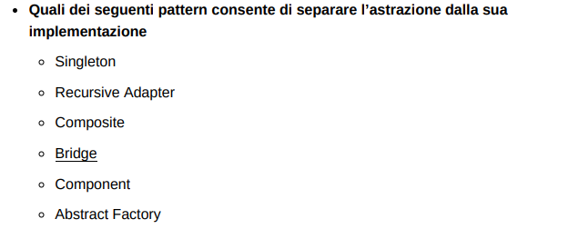
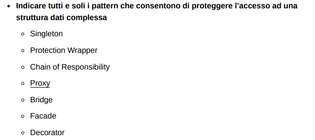
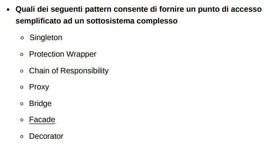
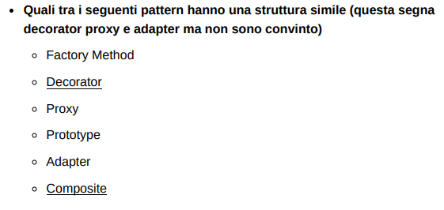
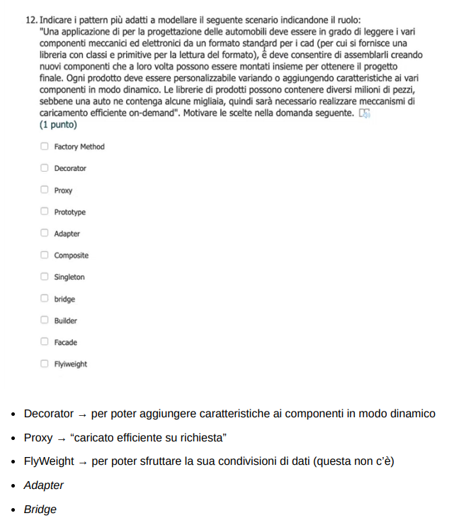

# Esonero Pattern Strutturali

#### 1)

- ###### a) **Proxy**:
   - Il Proxy è un design pattern strutturale che fornisce un sostituto o rappresentante di un altro oggetto per controllare l'accesso ad esso. Questo è utile per operazioni come il lazy loading, il controllo dell'accesso, il logging, ecc.

- ###### b) **Singleton**:
   - Il Singleton è un design pattern creazionale che assicura che una classe abbia una sola istanza, fornendo un punto di accesso globale a questa istanza.

- ###### c) **Adapter**:
   - L'Adapter è un design pattern strutturale che consente a oggetti con interfacce incompatibili di collaborare. "Traduce" l'interfaccia di un oggetto in un'altra interfaccia che il cliente si aspetta.

##### Risposta corretta:
    Proxy - Adapter

#### 2)

- ###### a) **Proxy**:
   - Serve come interfaccia per un altro oggetto, controllandone l'accesso, gestendone il ciclo di vita, o implementandone il caricamento pigro (lazy loading). Il Proxy può anche essere utilizzato per aggiungere ulteriori responsabilità in modo dinamico.

- ###### b) **Builder**:
   - Separa la costruzione di un oggetto complesso dalla sua rappresentazione, consentendo lo stesso processo di costruzione di produrre diverse rappresentazioni. È particolarmente utile quando un oggetto deve essere creato con molte possibili configurazioni e non si vuole avere un costruttore con un elenco enorme di parametri.

- ###### c) **Composite**:
   - Consente di comporre oggetti in strutture ad albero per rappresentare gerarchie parte-tutto. Questo pattern permette ai client di trattare oggetti individuali e composizioni di oggetti in modo uniforme.
  
##### Risposta corretta:
    Proxy - Composite

#### 3)

- ###### a) **Composite**:
   - Permette di costruire una gerarchia di oggetti inclusi oggetti composti e singoli oggetti foglia in modo che possano essere trattati allo stesso modo. Questo modello permette di costruire strutture complesse e di estendere funzionalità tramite composizione piuttosto che ereditarietà.

- ###### b) **Decorator**:
   - Fornisce un modo per aggiungere responsabilità a un oggetto dinamicamente, senza alterare il codice degli oggetti esistenti. È un'alternativa all'uso dell'ereditarietà per estendere le funzionalità di una classe perché consente l'aggiunta di nuove funzionalità a un oggetto in fase di esecuzione.

- ###### c) **Factory Method**:
   - Definisce un'interfaccia per creare un oggetto, ma lascia che le sottoclassi decidano quale classe istanziare. Questo pattern non fornisce un'alternativa alla sottoclasse per estendere le funzionalità di una classe, ma piuttosto un modo per delegare il processo di istanziazione a sottoclassi.

- ###### d) **Template Method**:
   - Definisce lo scheletro di un algoritmo in un metodo, posticipando alcuni passaggi all'ereditarietà da parte delle sottoclassi. Non fornisce un'alternativa alla sottoclasse per l'estensione delle funzionalità, ma piuttosto un framework in cui le sottoclassi possono sovrascrivere determinate parti di un algoritmo senza cambiare la sua struttura.

##### Risposta corretta:
######  **Decorator** e **Composite** sono i pattern che forniscono un'alternativa all'ereditarietà per estendere le funzionalità di una classe. Il Decorator aggiunge funzionalità dinamicamente, mentre il Composite consente di costruire strutture ad albero di oggetti che estendono le funzionalità attraverso la composizione.

#### 4)

Tra i design pattern elencati, il **Flyweight** è quello specificamente progettato per utilizzare la condivisione dei dati per gestire in modo efficiente un gran numero di oggetti. Vediamo in dettaglio:

- ###### a) **Decorator**:
   - Aggiunge dinamicamente responsabilità aggiuntive agli oggetti. Non è progettato per la condivisione di dati o stati, ma piuttosto per aggiungere funzionalità attraverso una composizione di oggetti.

- ###### b) **Flyweight**:
   - Questo pattern è usato per ridurre la quantità di memoria utilizzata quando si gestisce un grande numero di oggetti simili. Memorizza gli stati esterni condivisi in oggetti separati e li passa agli oggetti flyweight quando necessario. L'obiettivo è minimizzare l'uso della memoria condividendo il più possibile tra oggetti simili.

- ###### c-d) **Multiple-Object-Adapter** e **Two-Way Adapter**:
   - Questi Adapter sono varianti del pattern Adapter standard che permettono ad un oggetto di interfacciarsi o di adattarsi a più classi o interfacce. Non sono pensati specificatamente per la condivisione di informazioni per l'efficienza, ma per risolvere problemi di incompatibilità di interfacce.

- ###### e) **Prototype**:
   - Viene utilizzato per creare nuovi oggetti copiando un oggetto esistente, evitando così la costosa operazione di creazione. Mentre questo pattern può ridurre il costo della creazione di nuovi oggetti quando sono molto simili, non è specificamente progettato per la condivisione di dati al fine di gestire la memoria in modo efficiente come il Flyweight.

##### Risposta corretta:
    Flyweight 

#### 5)

Tra i design pattern elencati, . Ecco una breve spiegazione di ciascun pattern in relazione alla creazione di strutture ricorsive:

Gli altri pattern menzionati non sono primariamente pensati per strutture ricorsive:

- ###### a) **Singleton**:
   - Assicura che una classe abbia una sola istanza e fornisce un punto di accesso globale a quella istanza. Non è correlato alla modellazione di strutture ricorsive.

- ###### b) **Recursive Adapter**:
   - Un "Recursive Adapter" potrebbe essere un termine non standard, ma in generale, il pattern Adapter è usato per convertire l'interfaccia di una classe in un'altra interfaccia che i client si aspettano. Non è pensato per creare strutture ricorsive.

- ###### c) **Composite**:
   - Consente di comporre oggetti in strutture ad albero per rappresentare gerarchie parte-tutto. Questo pattern permette di trattare singoli oggetti e composizioni di oggetti in modo uniforme, essendo quindi ideale per creare strutture ricorsive.

- ###### d) **Component**:
   - Il termine "Component" in questo contesto è presumibilmente un riferimento agli oggetti utilizzati nel pattern Composite. I "componenti" nel Composite possono essere sia oggetti foglia che contenitori, e il pattern li tratta in modo ricorsivo.

- ###### e) **Bridge**:
   - Disaccoppia un'astrazione dall'implementazione in modo che le due possano variare indipendentemente. Anche questo pattern non è progettato per la creazione di strutture ricorsive.

- ###### f) **Abstract Factory**:
   - Fornisce un'interfaccia per creare famiglie di oggetti correlati o dipendenti senza specificare le loro classi concrete. Anche questo pattern non è inteso per la modellazione di strutture ricorsive.

##### Risposta corretta:
###### il pattern **Composite** e il concetto di "Component" associato sono quelli che permettono di modellare strutture ricorsive di componenti

#### 6)

##### Risposta corretta:
###### Il design pattern che consente di separare l'astrazione dalla sua implementazione è il **Bridge**. 
###### Questo pattern strutturale prevede di dividere una grande classe o un insieme di classi strettamente correlate in due gerarchie separate - astrazione e implementazione - che possono essere sviluppate in modo indipendente l'una dall'altra. Ciò consente di cambiare le implementazioni di un'astrazione senza che questo influenzi i clienti che usano quell'astrazione, e viceversa. Questo è particolarmente utile quando si vogliono estendere le classi in più dimensioni indipendenti.

#### 7)

- ###### a) **Proxy**:
   - **Descrizione**: Fornisce un sostituto o un segnaposto per un altro oggetto per controllarne l'accesso. Un proxy può essere utilizzato per gestire l'accesso, proteggere l'oggetto da accessi non autorizzati e implementare la sicurezza.

- ###### a) **Facade**:
   - **Descrizione**: Offre un'interfaccia unificata a un set di interfacce in un sottosistema, rendendo il sottosistema più facile da usare. Il Facade può semplificare e limitare l'accesso alla complessità sottostante, proteggendo i clienti da dettagli che non necessitano di conoscere.

Il **Chain of Responsibility**, il **Bridge** e il **Decorator** non sono specificamente progettati per proteggere l'accesso a strutture dati complesse:

Il **Singleton** non è direttamente collegato alla protezione dell'accesso alle strutture dati complesse; il suo scopo principale è garantire che una classe abbia una sola istanza.

Quindi, basandosi sull'intenzione del documento, i pattern che possono essere utilizzati per proteggere l'accesso a una struttura dati complessa includono il **Proxy** e il **Facade**, e possibilmente un concetto indicato come **Protection Wrapper**, che potrebbe essere una variante del pattern Proxy con un focus sulla sicurezza.

##### Risposta corretta:
###### **Proxy** e il **Facade**

#### 8)

##### Risposta corretta:
###### Il design pattern che consente di fornire un punto di accesso semplificato a un sottosistema complesso è il **Facade**. Questo pattern offre un'interfaccia unificata a un insieme di interfacce in un sottosistema, rendendo il sottosistema più facile da utilizzare. Facade aiuta a ridurre la complessità di un sistema fornendo un'interfaccia semplice, che può essere usata dai client per accedere al sistema, nascondendo la complessità sottostante.

#### 9)

- ###### a) **Factory Method**:
   - Questo pattern definisce un'interfaccia per la creazione di un oggetto, ma lascia che le sottoclassi decidano quale classe istanziare. La creazione di oggetti viene delegata a sottoclassi che estendono una classe astratta o implementano un'interfaccia.

- ###### b) **Template Method**:
   - Questo pattern definisce lo scheletro di un algoritmo in un metodo, ritardando alcuni passaggi all'ereditarietà da parte delle sottoclassi. Le sottoclassi possono ridefinire certi passi di questo algoritmo senza cambiare la sua struttura.

Gli altri pattern non si basano principalmente sull'ereditarietà:

- Il **Chain of Responsibility** passa la richiesta lungo una catena di handler fino a quando non viene gestita, non è incentrato sull'ereditarietà ma piuttosto su una catena di oggetti collegati tra loro.
- Il **Proxy** controlla l'accesso a un altro oggetto, non richiede ereditarietà per la sua implementazione primaria.
- Il **Prototype** si basa sulla copia di un oggetto esistente piuttosto che sulla creazione di sottoclassi.
- Il **Two-Way Adapter** permette a due interfacce incompatibili di lavorare insieme e può utilizzare l'ereditarietà, ma è più centrato sulla compatibilità tra interfacce diverse.

##### Risposta corretta:
###### **Factory Method** e il **Template Method**.

#### 10)

##### Risposta corretta:
###### Il pattern che ha una variante classica di oggetto è il **Prototype**. Il pattern Prototype consente di copiare oggetti esistenti senza rendere il codice dipendente dalle loro classi. Ogni oggetto che serve come prototipo per la copia è chiamato "prototype". Questo pattern è spesso utilizzato quando la creazione di un'istanza è più costosa rispetto alla clonazione di un oggetto esistente, o quando gli oggetti hanno un numero di configurazioni che non permette un'efficiente implementazione tramite costruttori tradizionali.

#### 11)

Tra i design pattern menzionati, Decorator, Proxy e Adapter hanno una struttura concettualmente simile nel senso che tutti e tre estendono o modificano il comportamento degli oggetti senza cambiarne la struttura interna. Tuttavia, ciascuno ha un obiettivo diverso:

- **Decorator** aggiunge nuove funzionalità a un oggetto in modo dinamico e trasparente per il resto del sistema.
- **Proxy** controlla l'accesso a un altro oggetto, agendo da intermediario.
- **Adapter** consente a interfacce incompatibili di collaborare.

Anche se i tre pattern condividono il concetto di "wrapping" di un oggetto con un altro, differiscono nel loro intento e nell'uso:

- Il **Decorator** è usato principalmente per aggiungere responsabilità aggiuntive a un oggetto in modo dinamico.
- Il **Proxy** è spesso usato per controllare l'accesso, per fare lazy loading o per implementare meccanismi di sicurezza.
- L'**Adapter** è usato per fare in modo che due interfacce incompatibili possano lavorare insieme.

**Factory Method**, **Prototype** e **Composite** hanno strutture e intenti diversi:

- **Factory Method** si occupa della creazione di oggetti senza specificarne la classe esatta.
- **Prototype** consente di creare nuovi oggetti clonandone uno esistente.
- **Composite** permette di comporre oggetti in strutture ad albero per rappresentare gerarchie parte-tutto.

#### 12)

